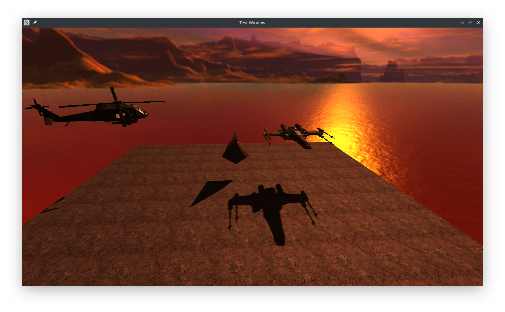

# [OpenGL Course](https://www.udemy.com/course/graphics-with-modern-opengl/) 
In this course a learned so many conceptos about create graphics with OpenGL and how implement them.

## Dependences
1. [GLEW 2.1.0](http://glew.sourceforge.net)
1. [GLFW 3.3.2](https://www.glfw.org)
1. [GLM 0.9.8](https://github.com/g-truc/glm/tree/89e52e327d7a3ae61eb402850ba36ac4dd111987)
1. [STB(stb_image)](https://github.com/nothings/stb/tree/f54acd4e13430c5122cab4ca657705c84aa61b08)
1. [Assimp 5.0.1](https://github.com/assimp/assimp/tree/assimp_5.0_release)